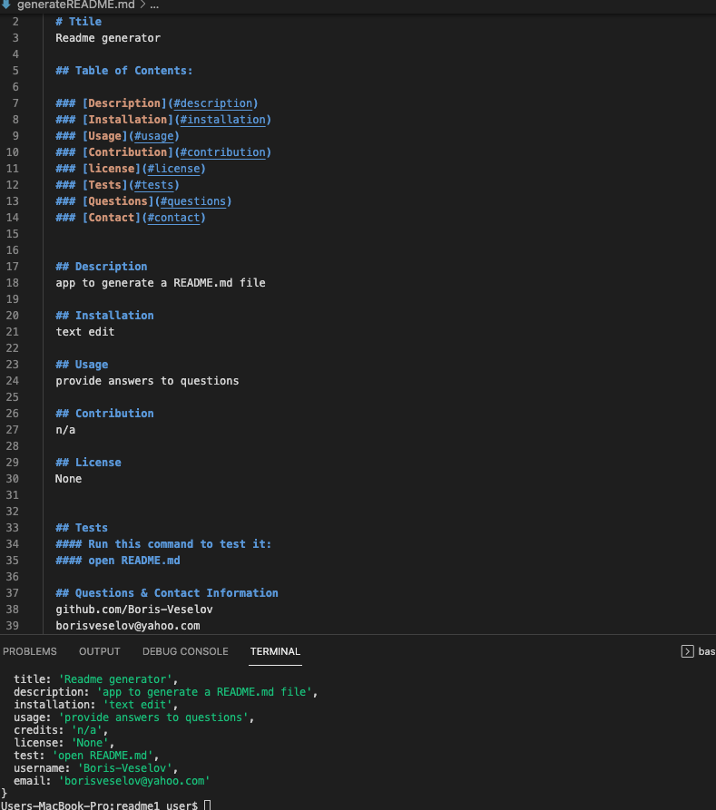

## Title

README generator

## Table of Contents:
  
* [Description](#description)
* [Technologies](#technologies)
* [Preview](#preview)
* [Website-link](#website-link)
* [Installation](#installation)
* [Usage](#usage)
* [Contribution](#contribution)
* [license](#license)
* [Contact](#contact)

## Description

A command-line application that dynamically generates a professional README.md file from a user's input using the Inquirer package. 

## Technologies

* Node.js
* Javascript

## Preview

## Demo

https://user-images.githubusercontent.com/96749114/160629417-a4b3fe61-47e6-49d2-8462-fe27cbf44959.mov

## Website-Link

https://boris-veselov.github.io/readme-generator/

## Usage

To run it locally, in Terminal type "node index" and follow the prompts and it will generate a new README.

## Contribution

Boris Veselov

## License
  
MIT license

## Contact

borisveselov@yahoo.com
github.com/boris-veselov
